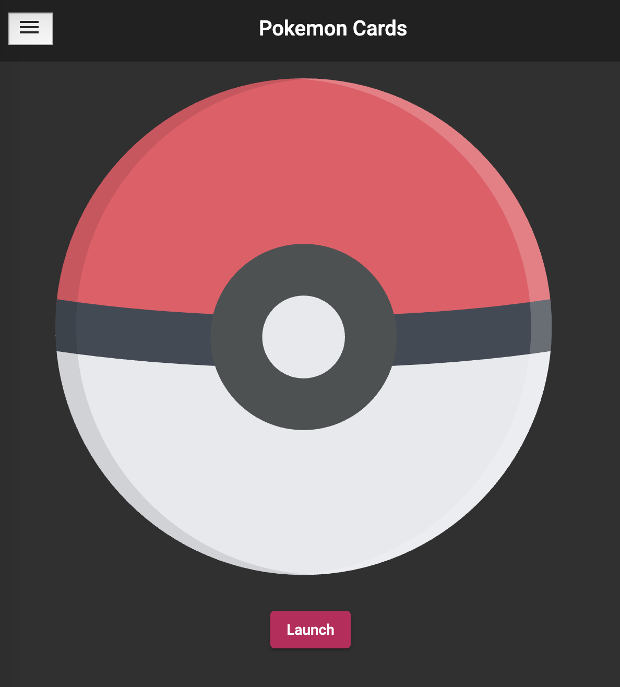

# Pokemon Deck

## Overview

This is my personal project to improve my front-end development and reactive programming skill.

Pokemon Deck is a dashboard for you to collect up to 5 random pokemon cards. The card is fetched from Pokemon public API called PokeAPI (https://pokeapi.co/).
I developed using Angular 9, material design, and custom SCSS files. A mock authenticationService is created to simulate real authentication interaction with a front-end system.
The angular CDK tool is used to help implementing drag and drop feature. I also experimented with lazy loading modules and Seo tag injections.

[Live Demo](https://pokemon.as12production.com)
